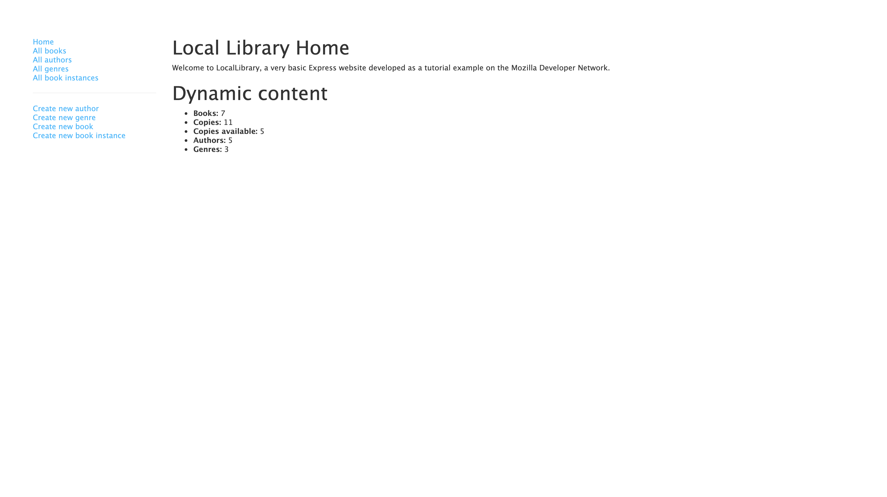

# Express Library 

Deployed: 

This is a library website that I made with Express while following the Odin Project's curriculum. While following that curiculum, I was directed to an MDN tutorial (https://developer.mozilla.org/en-US/docs/Learn/Server-side/Express_Nodejs/Tutorial_local_library_website) that provided code snippets and guidance for building this website. While some code was provided piece by piece as I read through the tutorial, other essential bits were left as a challenge and are original. Additionally, the view snippets provided in the tutorial were written in Pug, and I chose to translate them to Handlebars. 

This website allows users to view all books, book instances, authors, and genres listed in the library, and to add new books, book instances, authors, and genres (as if they were library staff). To store and maintain access to that data, I used MongoDB, and for validation and sanitization of inputs I was introduced (by the tutorial) to express-validator. 

Cosmetic niceties are, for the most part, neglected because the "express" purpose of this project was to practice back-end development techniques. 

